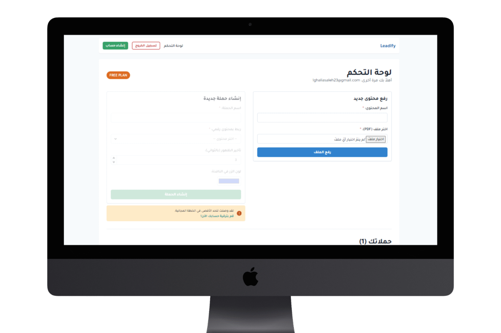

# Leadify 🚀
### Turn Visitors Into Subscribers — Automatically

Leadify is a full-stack SaaS platform that helps content creators and businesses capture leads and deliver digital content automatically. No more manual emails, no more missed opportunities.

---

## 📸 Dashboard Preview



---

## 🧩 The Problem

You've created valuable digital content — an eBook, a guide, a mini-course. But converting interested visitors into a real email list is painful:

- Manually sending files to every request is exhausting
- Traditional forms lose visitors at the wrong moment
- You miss leads when people are most interested

**Leadify solves this by automating the entire process.**

---

## ✨ Key Features

| Feature | Description |
|--------|-------------|
| 🎯 Smart Popups | Control when and how subscription forms appear — on exit intent, after time delay, or on scroll |
| ⚡ Instant Delivery | Visitor submits email → content delivered automatically within seconds |
| 📊 Central Dashboard | Manage all campaigns, uploads, and subscribers from one place |
| 🎨 Full Branding Control | Customize colors, text, and buttons to match your brand |
| 📋 Subscriber Lists | Separate list per campaign — view and export as CSV anytime |
| 🔌 Easy Integration | One line of code — works with WordPress, Google Tag Manager, or any website |

---

## 🛠️ Tech Stack

**Frontend:**
- React.js
- CSS Modules

**Backend:**
- Python (FastAPI)
- PostgreSQL
- Docker

**Infrastructure:**
- REST API architecture
- Automated email delivery system
- Widget injection via single script tag

---

## 🚀 How It Works

```
1. Create Campaign  →  Upload your file + customize your popup
2. Copy One Line    →  Paste the script into your website once
3. Watch It Grow    →  Leadify collects emails & delivers content automatically
```

---

## 📁 Project Structure

```
Leadify/
├── frontend/          # React application
│   ├── src/
│   └── public/
├── backend/           # FastAPI application
│   ├── main.py
│   ├── models/
│   ├── routes/
│   └── services/
└── test-site.html     # Integration test page
```

---

## ⚙️ Getting Started

### Prerequisites
- Python 3.9+
- Node.js 16+
- PostgreSQL

### Backend Setup
```bash
cd backend
pip install -r requirements.txt
uvicorn main:app --reload
```

### Frontend Setup
```bash
cd frontend
npm install
npm start
```

---


## 👩‍💻 About the Developer

Built by **Ghalia Saleh** — Informatics Engineer specialized in full-stack web development.
- 📧 ghaliasaleh23@gmail.com

---

## 📄 License

This project is for portfolio demonstration purposes.
